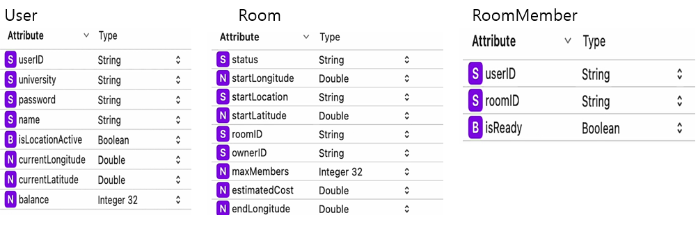
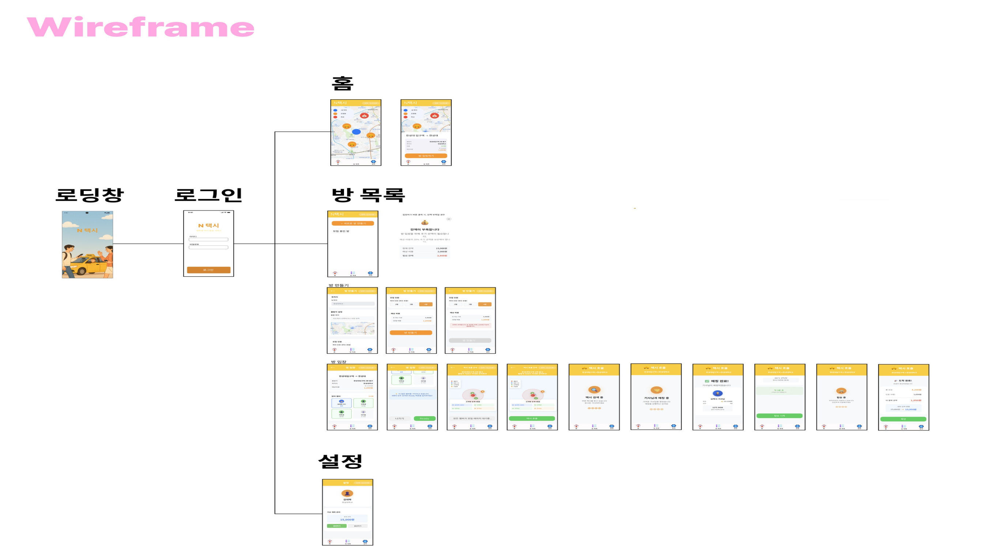
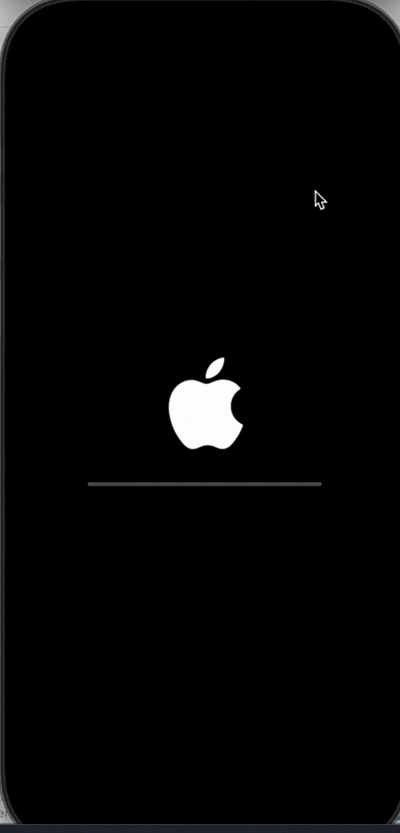
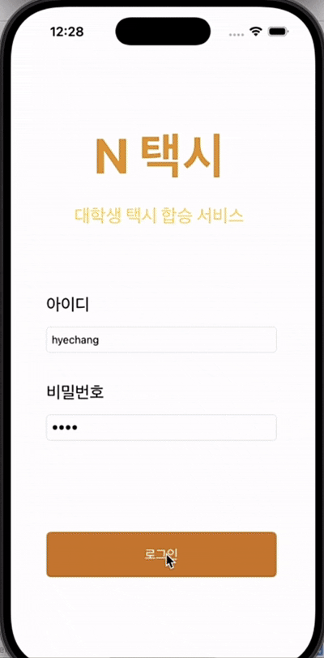
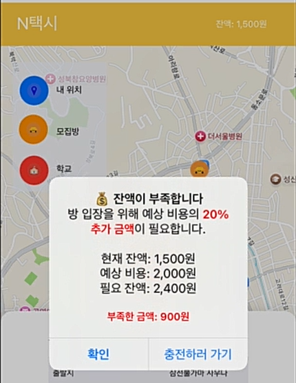
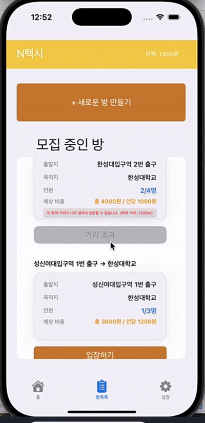
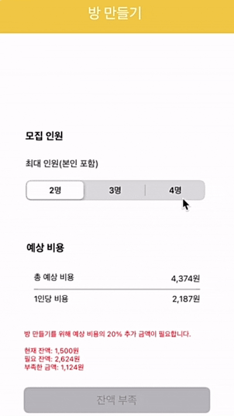
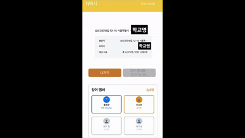
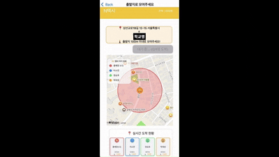

# 🚕 N택시 (N-Taxi)

> iOS 기반 대학생 전용 택시 합승 플랫폼

<br>

## 📖 프로젝트 개요

**N택시**는 같은 대학교 학생들이 학교를 목적지로 하는 택시를 합승하여 교통비를 N분의 1로 절감할 수 있는 iOS 네이티브 앱입니다.
실시간 위치 기반 매칭과 단계별 합승 프로세스를 통해 안전하고 편리한 택시 합승 경험을 제공합니다.

### 📅 개발 기간
**2024년 4월 ~ 2024년 6월** (3개월)

### 👤 개발 인원
**1인 개발**

### 🎯 개발 목적

**실제 불편함에서 출발한 문제 해결 프로젝트**

대학 생활 중 환승 시 학교로 가는 버스가 항상 만차이거나 오래 기다려야 하는 문제를 겪었습니다. 정류장에서 대기하는 사람들을 보니 대부분 같은 학교 학생들이었고, "이 사람들과 함께 택시를 N분의 1로 나눠 타면 버스비와 비슷한 금액으로 더 빠르고 편하게 갈 수 있지 않을까?"라는 생각에서 프로젝트를 시작했습니다.

또한 모르는 사람보다는 같은 학교 학생들과 함께 탑승하면 **심리적 안전감**과 **신뢰성**을 확보할 수 있다는 점도 중요한 기획 포인트였습니다.

**기술적 목표**
- Swift와 UIKit을 활용한 iOS 네이티브 앱 개발 경험
- CoreLocation과 MapKit을 활용한 실시간 위치 기반 서비스 구현
- Core Data를 활용한 로컬 데이터베이스 설계 및 운영

<br>

## ✨ 주요 기능

### 🗺️ 1. 실시간 위치 기반 합승방 매칭
- **거리 기반 필터링**: 현재 위치에서 1000m 이내의 합승방만 표시
- **대학교별 그룹화**: 같은 학교 학생들끼리만 합승 가능
- **지도 시각화**: MapKit을 활용하여 출발지, 목적지, 내 위치를 직관적으로 표시

### 🚖 2. 7단계 스마트 합승 프로세스
1. **대기실**: 참여 멤버 확인 및 준비 상태 체크
2. **집합**: 출발지 100m 반경 내 실시간 위치 추적
3. **택시 검색**: 자동 택시 호출 시뮬레이션
4. **기사 매칭**: 택시 배정 대기
5. **매칭 완료**: 기사 정보 확인
6. **탑승 중**: 목적지까지 이동 추적
7. **정산**: 실제 요금 자동 분할 및 계좌 차감

### 💰 3. 자동 요금 계산 및 안전 장치
- **예상 요금 계산**: 거리 기반 서울 택시 요금 자동 산출
- **잔액 검증 시스템**: 예상 비용의 120% 이상 보유 시에만 방 생성/입장 가능
- **실시간 정산**: 탑승 완료 후 실제 요금의 1/N 자동 차감

### 👥 4. 방 생성 및 참여 시스템
- **2단계 방 생성 프로세스**: 
  - Step 1: 출발지 선택 (지도 탭 또는 주소 직접 입력)
  - Step 2: 인원 선택 및 비용 확인
- **동적 입장 조건 검증**: 
  - 거리 제한 (1000m 이내)
  - 잔액 확인 (예상 비용의 120%)
  - 방 상태 확인 (모집중/대기중/완료)
- **실시간 상태 관리**: 모집중 → 대기중 → 완료 단계별 자동 전환

<br>

## 🛠️ 기술 스택

### iOS Development
- 
- 
- 

### 주요 프레임워크

| 프레임워크 | 용도 |
|-----------|------|
| **CoreLocation** | GPS 기반 실시간 위치 추적 및 거리 계산 |
| **MapKit** | 지도 표시, 마커 관리, 오버레이 렌더링 |
| **Core Data** | 로컬 데이터베이스 (User, Room, RoomMember) |
| **Foundation** | 타이머, 날짜, 데이터 처리 등 기본 기능 |

<br>

## 🏗️ 시스템 아키텍처

### 📊 데이터 모델 구조



#### Core Data Entities

**User (사용자)**
```swift
- userID: String (Primary Key)          // 사용자 고유 ID
- password: String                       // 비밀번호
- name: String                           // 이름
- university: String                     // 소속 대학교
- balance: Int32                         // 계좌 잔액
- currentLatitude: Double                // 현재 위치 위도
- currentLongitude: Double               // 현재 위치 경도
- isLocationActive: Bool                 // 위치 추적 활성화 여부
```

**Room (합승방)**
```swift
- roomID: String (Primary Key)           // 방 고유 ID
- ownerID: String                        // 방장 ID
- startLocation: String                  // 출발지 주소
- startLatitude: Double                  // 출발지 위도
- startLongitude: Double                 // 출발지 경도
- endLocation: String                    // 목적지 (대학교)
- endLatitude: Double                    // 목적지 위도
- endLongitude: Double                   // 목적지 경도
- currentMembers: Int32                  // 현재 인원
- maxMembers: Int32                      // 최대 인원 (2~4명)
- estimatedCost: Double                  // 예상 총 비용
- costPerPerson: Int32                   // 인당 비용
- status: String                         // 방 상태 (모집중/대기중/완료)
```

**RoomMember (참여 멤버)**
```swift
- roomID: String                         // 방 ID (Foreign Key)
- userID: String                         // 사용자 ID (Foreign Key)
- isReady: Bool                          // 준비 완료 여부
```

### 🔄 데이터 흐름
```
1. 사용자 로그인
   ↓
2. Core Data에서 인증 정보 확인
   ↓
3. CoreLocation으로 현재 위치 수집 (GPS)
   ↓
4. MapKit으로 지도에 합승방 표시
   ↓
5. 방 입장/생성 → Core Data 업데이트
   ↓
6. 실시간 위치 추적 → User 테이블 동기화
   ↓
7. 탑승 완료 → 요금 정산 → balance 차감
```

<br>

## 📱 주요 화면 구성

### 🎬 전체 화면 구조



---

### 1️⃣ 스플래시 & 로그인

| 스플래시 화면 | 로그인 화면 |
|-------------|-----------|
|  |  |

**기능**
- 앱 시작 시 2초간 브랜드 로딩 애니메이션 표시
- 더미 데이터 자동 초기화 (개발/테스트용)
- Core Data 기반 로그인 인증

**구현 특징**
- UserDefaults를 활용한 자동 로그인 세션 유지
- 테스트를 위한 12명의 더미 사용자 자동 생성
- 실제 서비스 구현 시 회원가입 기능 추가 예정

---

### 2️⃣ 홈 - 합승방 지도


**주요 기능**
- 📍 **실시간 위치 표시**: CoreLocation으로 사용자의 현재 위치를 파란색 원형 마커로 표시
- 🚕 **합승방 마커**: 출발지별로 주황색 택시 아이콘 표시
- 🏫 **목적지 고정**: 학교 위치를 빨간색 마커로 표시
- 🔍 **거리 기반 필터링**: 1000m 이내 방만 자동 필터링

**입장 조건 검증**

| 조건 | 설명 |
|------|------|
| **거리 조건** | 출발지로부터 1000m 이내 |
| **잔액 조건** | 예상 비용의 120% 이상 보유 |
| **방 상태** | "모집중" 상태인 경우만 |

**잔액 부족 시 알림**



- 예상 비용의 20% 추가 금액이 필요한 이유 안내
- 현재 잔액 / 필요 잔액 / 부족한 금액 표시
- 충전 페이지로 바로 이동 가능

---

### 3️⃣ 방 목록



**표시 정보**
- 출발지 → 목적지
- 현재 인원 / 최대 인원
- 총 비용 / 인당 비용
- 출발지와의 거리 (실시간 계산)
- 입장 가능 여부 (거리 및 잔액 조건)

**실시간 업데이트**
- 5초마다 방 목록 자동 새로고침
- 위치 변경 시 거리 재계산
- 다른 사용자 입장 시 인원 수 즉시 반영

**카드형 UI 디자인**
- 조건 충족 시: 주황색 "입장하기" 버튼 활성화
- 거리 초과 시: 회색 "거리 초과" 버튼 비활성화
- 에러 메시지: 빨간색 배경으로 문제점 명확히 표시

---

### 4️⃣ 방 만들기 (2단계)

#### Step 1: 출발지 선택


**기능**
- 🗺️ **지도 탭**: 원하는 위치 클릭으로 출발지 설정
- ⌨️ **주소 직접 입력**: 텍스트 필드에 주소 입력 (자동 지오코딩)
- 📍 **현재 위치 표시**: 파란색 원형 마커로 내 위치 표시
- 🚕 **출발지 마커**: 선택한 위치에 주황색 택시 마커 표시

**검증 조건**
- 출발지가 현재 위치에서 **1000m 이내**에 있어야 함
- 거리 초과 시 빨간색 에러 메시지 표시 및 "다음" 버튼 비활성화

**목적지 고정**
- 로그인한 사용자의 대학교로 자동 설정 (수정 불가)

---

#### Step 2: 인원 선택 및 비용 확인



**기능**
- 👥 **인원 선택**: 2명 / 3명 / 4명 중 선택 (방장 포함)
- 💰 **동적 비용 계산**: 인원 변경 시 인당 비용 실시간 계산
- 📊 **예상 비용 표시**: 총 비용 / 인당 비용 명확히 표시

**잔액 검증**
- 예상 비용의 **120% 이상** 보유해야 방 생성 가능
- 부족한 경우 빨간색 배경의 상세 에러 메시지 표시
  - 현재 잔액
  - 필요 잔액 (인당 비용 × 1.2)
  - 부족한 금액

**방 생성 완료**
- 모든 조건 충족 시 주황색 "방 만들기" 버튼 활성화
- 방 생성 즉시 해당 방의 상세 화면으로 자동 이동

---

### 5️⃣ 방 상세 - 7단계 합승 프로세스

#### 1단계: 대기실 - 멤버 모집



**기능**
- 👥 **참여 멤버 카드**: 4열 그리드 레이아웃으로 멤버 표시
  - 프로필 아이콘 (방장: 🙋‍♂️ / 일반: 👤)
  - 이름 (본인 표시: "홍혜창(나)")
  - 준비 상태 (참여중 / 준비됨 / 빈 자리)
- 🎨 **색상 코딩**: 
  - 방장: 파란색 테두리 (항상 Ready 상태)
  - 준비 완료: 초록색 테두리
  - 대기 중: 주황색 테두리
  - 빈 자리: 회색 테두리

**시작 조건**
- 모든 멤버가 "준비됨" 상태일 때 주황색 "시작" 버튼 활성화
- 혼자 있거나 일부 멤버만 준비된 경우 버튼 비활성화

**시뮬레이션**
- 테스트를 위해 더미 사용자가 자동으로 입장
- 5초 후부터 랜덤하게 멤버 추가
- 정원이 차면 3초 후부터 멤버들이 순차적으로 Ready 상태로 변경

---

#### 2단계: 집합 - 출발지로 모이기



**기능**
- 🗺️ **실시간 위치 추적**: 1초마다 모든 멤버의 위치 업데이트
- 🎯 **100m 원형 오버레이**: 출발지 중심 빨간색 반투명 원 표시
- 🏷️ **멤버별 색상 마커**: 각 멤버를 구분할 수 있는 고유 색상 원형 마커
- 📊 **실시간 도착 현황**: 각 멤버의 거리와 상태를 카드로 표시
  - 거리 표시 (예: 450m)
  - 상태: "🚶‍♂️ 이동중" / "✅ 도착"

**범례 표시**
- 좌측 하단에 각 멤버의 색상과 이름 매칭 정보 제공
- 본인 표시: "홍혜창 (나)"

**택시 호출 조건**
- 모든 멤버가 100m 이내에 도착해야 함
- 방장만 "🚕 택시 호출하기" 버튼 활성화
- 일반 멤버는 "방장이 택시를 호출할 예정입니다" 메시지 표시

**위치 시뮬레이션**
- 초기 위치: 출발지로부터 500~1000m 랜덤 배치
- 이동: 1초마다 출발지 방향으로 거리의 10~20%씩 이동

---

#### 3~7단계: 택시 호출부터 정산까지


**3단계: 택시 검색**
- 🔍 맥박 애니메이션과 함께 "택시 검색 중..." 표시
- 3초 후 자동으로 다음 단계 이동

**4단계: 기사님 매칭**
- 👥 회전 애니메이션과 함께 "기사님 매칭 중..." 표시
- 2초 후 자동으로 다음 단계 이동

**5단계: 매칭 완료**
- ✅ 기사님 프로필 정보 표시
- 초록색 "탑승 시작" 버튼 활성화

**6단계: 탑승 중**
- 🚗 자동차 아이콘과 함께 좌우 이동 애니메이션
- "목적지까지 이동 중..." 메시지 표시
- 3초 후 자동으로 목적지 도착

**7단계: 요금 정산**
- 💰 **실제 요금 계산**: 예상 비용의 ±10% 랜덤 변동
- 📊 **정산 정보 표시**:
  - 인당 비용: 큰 글씨로 강조
  - 총 비용: 작은 글씨로 참고 정보
  - 잔액 변화: "이전 금액 → 새 금액" (빨간색 강조)
- 💳 **자동 결제**: Core Data의 User.balance에서 자동 차감
- ✅ 확인 버튼 클릭 시 방 목록으로 이동

---

### 6️⃣ 설정 페이지


**기능**
- 👤 **사용자 정보 표시**: 프로필 아이콘, 이름, 소속 대학교
- 💰 **현재 잔액**: 큰 글씨로 강조 표시
- ➕ **충전하기**: 1천원 ~ 10만원 또는 직접 입력
- ➖ **출금하기**: 현재 잔액 범위 내에서 선택 가능

**액션시트 UI**
- 금액 선택 시 하단에서 올라오는 액션시트 표시
- 미리 정의된 금액 버튼 (1천원, 5천원, 1만원 등)
- "직접 입력" 옵션으로 자유로운 금액 설정

**실시간 반영**
- 충전/출금 즉시 Core Data 업데이트
- 화면에 새 잔액 표시
- 성공 알림 팝업 (충전/출금 금액, 현재 잔액)

---

<br>

## 🔧 트러블슈팅

### 문제: 지도 탭 제스처와 버튼 클릭 우선순위 충돌

#### 🔴 **문제 상황**

방 만들기 화면에서 출발지를 선택하는 과정에서 치명적인 UX 문제가 발생했습니다.

**재현 순서:**
```
1. 지도에서 출발지를 탭으로 선택 ✅
2. 출발지가 지도에 주황색 택시 마커로 표시됨 ✅
3. 텍스트 필드에 주소 자동 입력됨 ✅
4. "다음" 버튼이 주황색으로 활성화됨 ✅
5. "다음" 버튼 클릭 시도 ❌ → 반응 없음!
```

사용자는 모든 조건을 충족했지만 다음 단계로 진행할 수 없는 상황이 발생했습니다.

---

#### 🔍 **원인 분석**

**1차 원인: UITapGestureRecognizer의 잘못된 범위 설정**
```swift
// ❌ 문제가 있던 코드
private func setupMapTapGesture() {
    let tapGesture = UITapGestureRecognizer(target: self, action: #selector(mapTapped(_:)))
    view.addGestureRecognizer(tapGesture)  // 전체 view에 제스처 추가!
}
```

**문제점:**
- `mapView`가 아닌 **전체 `view`에 제스처를 추가**
- 지도 영역 뿐만 아니라 버튼 영역까지 제스처가 적용됨
- 버튼을 클릭해도 제스처가 먼저 이벤트를 가로챔

**iOS 이벤트 처리 우선순위:**
```
UIGestureRecognizer (높음)
    ↓
UIControl (UIButton, UITextField 등)
```

제스처가 버튼보다 **우선순위가 높아서** 버튼의 `@IBAction` 메서드가 호출되지 않았습니다.

---

**2차 원인: 키보드 숨김 제스처의 과도한 활성화**
```swift
// ❌ 문제가 있던 코드
override func viewDidLoad() {
    let tapGesture = UITapGestureRecognizer(target: self, action: #selector(dismissKeyboard))
    view.addGestureRecognizer(tapGesture)  // 항상 활성화 상태!
}
```

**문제점:**
- 주소 입력 시 키보드를 숨기기 위한 제스처를 전체 화면에 추가
- **키보드가 없을 때도** 제스처가 계속 활성화되어 있음
- 이 제스처도 버튼 클릭을 방해함

---

#### ✅ **해결 방법**

**1단계: 버튼에 독점 터치 권한 부여**
```swift
private func setupButtonPriority() {
    nextButton.isUserInteractionEnabled = true
    nextButton.isExclusiveTouch = true  // 🔥 핵심: 독점 터치 보장
    
    // 터치 이벤트 강화
    nextButton.addTarget(self, action: #selector(nextButtonTouchDown), for: .touchDown)
}
```

**효과:**
- `isExclusiveTouch = true` 설정으로 **다른 제스처가 무시됨**
- 버튼 터치 시 다른 뷰의 터치 이벤트가 전달되지 않음
- `.touchDown` 이벤트로 터치 시작부터 감지

---

**2단계: 키보드 상태에 따라 제스처 동적 관리**
```swift
private func setupKeyboardObserver() {
    // 키보드 나타날 때
    NotificationCenter.default.addObserver(
        self,
        selector: #selector(keyboardWillShow),
        name: UIResponder.keyboardWillShowNotification,
        object: nil
    )
    
    // 키보드 사라질 때
    NotificationCenter.default.addObserver(
        self,
        selector: #selector(keyboardWillHide),
        name: UIResponder.keyboardWillHideNotification,
        object: nil
    )
}

@objc private func keyboardWillShow() {
    addKeyboardDismissGesture()  // 🔥 키보드 있을 때만 제스처 추가
}

@objc private func keyboardWillHide() {
    removeKeyboardDismissGesture()  // 🔥 키보드 없으면 제스처 제거
}

private func addKeyboardDismissGesture() {
    removeKeyboardDismissGesture()  // 기존 제스처 제거
    
    let tapGesture = UITapGestureRecognizer(target: self, action: #selector(dismissKeyboard))
    tapGesture.cancelsTouchesInView = false  // 다른 터치 이벤트 방해하지 않음
    tapGesture.delegate = self
    view.addGestureRecognizer(tapGesture)
    view.tag = 999  // 식별용 태그
}

private func removeKeyboardDismissGesture() {
    if let gestures = view.gestureRecognizers {
        for gesture in gestures where gesture is UITapGestureRecognizer && view.tag == 999 {
            view.removeGestureRecognizer(gesture)
        }
    }
    view.tag = 0
}
```

**효과:**
- 키보드가 **없을 때는 제스처가 완전히 제거됨**
- 불필요한 제스처 충돌 원천 차단
- `NotificationCenter`를 활용한 정확한 타이밍 제어

---

**3단계: UIGestureRecognizerDelegate로 세밀한 제어**
```swift
extension FirstSetViewController: UIGestureRecognizerDelegate {
    
    // 제스처 인식 조건 설정
    func gestureRecognizer(_ gestureRecognizer: UIGestureRecognizer, 
                          shouldReceive touch: UITouch) -> Bool {
        
        // 🔥 버튼 터치 시 제스처 무시
        if touch.view == nextButton || touch.view?.isDescendant(of: nextButton) == true {
            print("🔥 버튼 클릭 감지 - 제스처 무시")
            return false  // 제스처 발동 안 함 → 버튼 클릭 우선
        }
        
        // 지도 제스처인 경우 허용
        if gestureRecognizer.view == mapView {
            return true
        }
        
        // 키보드 숨김 제스처는 키보드 활성화 상태에서만
        if gestureRecognizer.view?.tag == 999 {
            return startLabel.isFirstResponder  // 텍스트 필드 활성화 상태 확인
        }
        
        return true
    }
    
    // 제스처 시작 전 추가 검증
    func gestureRecognizerShouldBegin(_ gestureRecognizer: UIGestureRecognizer) -> Bool {
        let touchPoint = gestureRecognizer.location(in: view)
        let buttonFrame = nextButton.frame
        
        // 버튼 영역 터치 시 제스처 차단
        if buttonFrame.contains(touchPoint) {
            print("🔥 버튼 영역 터치 - 제스처 차단")
            return false
        }
        
        return true
    }
}
```

**효과:**
- Delegate 메서드로 **터치 위치별로 제스처 허용 여부 결정**
- 버튼 영역에서는 제스처가 **아예 동작하지 않음**
- 지도 영역에서는 제스처가 정상 작동

---

#### 📊 **해결 결과 비교**

| 항목 | 문제 발생 시 | 해결 후 |
|-----|------------|--------|
| **버튼 클릭** | ❌ 반응 없음 | ✅ 정상 동작 |
| **제스처 범위** | 전체 화면 | 필요한 영역만 |
| **키보드 제스처** | 항상 활성화 | 키보드 있을 때만 |
| **우선순위** | 제스처 > 버튼 | 버튼 > 제스처 |
| **사용자 경험** | 혼란스러움 | 직관적 |

---

#### 💡 **배운 점**

1. **iOS 이벤트 처리 우선순위 이해**
   - UIGestureRecognizer와 UIControl의 우선순위 관계
   - `isExclusiveTouch` 속성의 중요성

2. **제스처 범위의 중요성**
   - 전체 `view`가 아닌 **필요한 영역에만** 제스처 추가
   - `cancelsTouchesInView` 속성 활용

3. **동적 제스처 관리**
   - `NotificationCenter`를 활용한 상태 기반 제스처 제어
   - 불필요한 제스처는 즉시 제거하여 충돌 방지

4. **UIGestureRecognizerDelegate의 강력함**
   - `shouldReceive`, `shouldBegin` 메서드로 세밀한 제어 가능
   - 터치 위치 기반 동적 처리

---

<br>

## 🎯 프로젝트 성과 및 학습 내용

### 📚 기술적 성과

#### 1. iOS 네이티브 개발 경험 확보
- **Swift 언어 학습**: 기존 Android Java 경험을 바탕으로 Swift 문법 습득
- **UIKit 프레임워크 이해**: Storyboard 기반 UI 설계 및 IBOutlet/IBAction 연결
- **함수 호출 방식 차이**: Objective-C 스타일의 메서드 명명 규칙 이해
```swift
  // Swift의 명시적 파라미터 레이블
  func calculateTaxiCost(from start: CLLocationCoordinate2D, to end: CLLocationCoordinate2D)
```

#### 2. 위치 기반 서비스 구현
- **CoreLocation**: GPS 기반 실시간 위치 추적 (정확도: kCLLocationAccuracyBest)
- **MapKit**: 지도 렌더링, 커스텀 마커, 오버레이(100m 원형) 구현
- **거리 계산**: `CLLocation.distance(from:)` 메서드 활용
- **지오코딩/역지오코딩**: 주소 ↔ 좌표 변환 (CLGeocoder)

#### 3. Core Data 로컬 데이터베이스 설계
- **Entity 모델링**: User, Room, RoomMember 3개 테이블 설계
- **관계 설정**: Foreign Key 개념 구현 (roomID, userID)
- **CRUD 작업**: NSFetchRequest를 활용한 데이터 조회/수정/삭제
- **실시간 동기화**: `context.save()`를 통한 데이터 영속성 보장

#### 4. 복잡한 UI/UX 구현
- **7단계 프로세스 관리**: 상태 기반 화면 전환 (모집중 → 대기중 → 완료)
- **동적 UI 업데이트**: Timer를 활용한 실시간 위치/인원 정보 갱신
- **제스처 우선순위 제어**: UIGestureRecognizerDelegate 활용
- **애니메이션**: 로딩 스피너, 맥박 효과, 회전 효과 등

---

### 🚀 향후 개선 방향

#### 1. 실제 결제 시스템 구현
**현재 상태:**
- 앱 내 가상 잔액 시스템 (충전/출금 시뮬레이션)

**개선 목표:**
- 카카오페이/토스 등 **실제 결제 API 연동**
- PG사 연동을 통한 안전한 결제 환경 구축
- 에스크로 방식으로 탑승 완료 시에만 결제 확정

---

#### 2. 택시 기사님 전용 앱 개발
**현재 상태:**
- 학생용 앱만 존재 (기사 매칭은 시뮬레이션)

**개선 목표:**
- **기사용 별도 앱 개발**: 호출 수락, 위치 공유, 정산 관리
- **양방향 통신**: 학생 ↔ 기사 실시간 위치 공유
- **수입 관리**: 기사님의 일일/월별 수입 통계

---

#### 3. 백엔드 서버 구축
**현재 상태:**
- Core Data 로컬 데이터베이스 사용
- 멀티 유저 환경을 자동 더미 사용자로 시뮬레이션

**문제점:**
- 실제 여러 사용자가 동시에 앱을 사용할 수 없음
- 다른 기기 간 데이터 동기화 불가능
- 방 생성/입장 정보가 기기마다 독립적으로 관리됨

**개선 목표:**
- **Firebase Realtime Database** 또는 **AWS RDS** 도입
- RESTful API 서버 구축 (Node.js/Express 또는 Spring Boot)
- **실시간 동기화**: 방 정보, 멤버 상태, 위치 정보를 모든 기기에 즉시 반영
- **푸시 알림**: 멤버 입장, 택시 도착 등 중요 이벤트 알림

**기대 효과:**
```
현재: 1대의 기기 내에서만 테스트 가능
개선 후: 여러 학생이 각자 기기로 동시에 방 생성/입장 가능
```

---

### 🎓 배운 점 및 소감

이 프로젝트를 통해 단순히 코드를 작성하는 것을 넘어서, **실제 사용자의 불편함을 기술로 해결하는 과정**을 경험했습니다.

**기술적으로:**
- Swift의 Optional 처리(`guard let`, `if let`)와 강타입 시스템의 장점 이해
- iOS 생명주기(`viewDidLoad`, `viewWillAppear`)와 메모리 관리(`deinit`) 학습
- Delegation 패턴을 통한 뷰 컨트롤러 간 데이터 전달 구현

**기획적으로:**
- 사용자 시나리오 기반 7단계 프로세스 설계
- 안전 장치 구현의 중요성 (잔액 120% 검증, 거리 제한)
- 실시간 피드백의 중요성 (거리 계산, 상태 업데이트)

---

<br>

## 🌟 기대 효과

### 💰 경제적 효과
- **교통비 절감**: 혼자 타는 택시비 대비 1/2 ~ 1/4 절약
- **예시**: 4,000원 택시비 → 4명 합승 시 1,000원 (버스비와 유사)
- **학생 특화**: 경제적 부담이 큰 대학생들에게 실질적 도움

### ⏱️ 시간 절약
- **대기 시간 단축**: 만차 버스를 기다리지 않고 즉시 출발
- **환승 불편 해소**: 직행으로 학교까지 이동
- **지각 방지**: 중요한 수업이나 시험에 늦지 않을 수 있음

### 🛡️ 안전성 향상
- **신뢰성**: 같은 학교 학생들끼리만 매칭
- **심리적 안전감**: 모르는 사람보다 같은 커뮤니티 멤버와의 동승
- **위치 추적**: 실시간 GPS 기반 탑승 과정 모니터링

---

<br>

## 📌 참고 사항

### 프로젝트 특징
- 개인 프로젝트로 진행하여 **기획부터 개발까지 전 과정 경험**
- 실제 불편함에서 출발한 **문제 해결형 프로젝트**
- iOS 네이티브 개발 **첫 경험 프로젝트**
- **로컬 데이터베이스 기반**으로 구현하여 서버 없이 동작 가능

### 테스트 환경
- 더미 사용자 12명 자동 생성
- 멀티 유저 환경 시뮬레이션을 위한 자동 입장/준비 로직 구현
- 실제 GPS 위치 추적 대신 좌표 기반 시뮬레이션 지원

### 개발 환경
- Xcode 15.0+
- iOS 17.0+ 타겟
- Swift 5.0+
- Simulator 및 실제 기기 테스트 완료

---

<br>

## 📂 프로젝트 구조
```
NTAXI_IOS/
├── Controllers/
│   ├── LoginViewController.swift              # 로그인 화면
│   ├── HomeViewController.swift                # 홈 - 지도 화면
│   ├── RoomListViewController.swift            # 방 목록 화면
│   ├── CreateRoomViewController.swift          # 방 만들기 메인
│   ├── FirstSetViewController.swift            # 방 만들기 - 출발지 선택
│   ├── SecondSetViewController.swift           # 방 만들기 - 인원 선택
│   ├── RoomDetailViewController.swift          # 방 상세 메인
│   ├── StepOneController.swift                 # 대기실
│   ├── StepTwoController.swift                 # 집합 단계
│   ├── StepThreeController.swift               # 택시 검색
│   ├── StepFourController.swift                # 기사 매칭
│   ├── StepFiveController.swift                # 매칭 완료
│   ├── StepSixController.swift                 # 탑승 중
│   ├── StepSevenController.swift               # 정산
│   └── SettingsViewController.swift            # 설정 페이지
│
├── Views/
│   └── CustomTableViewCell.swift               # 방 목록 커스텀 셀
│
├── Models/
│   ├── CoreDataManager.swift                   # Core Data 관리
│   └── Model.xcdatamodeld                      # Core Data 스키마
│
├── Resources/
│   ├── Assets.xcassets/                        # 이미지 리소스
│   │   ├── mylocation                          # 내 위치 아이콘
│   │   ├── taxi                                # 택시 아이콘
│   │   ├── school                              # 학교 아이콘
│   │   └── appLoading                          # 로딩 이미지
│   └── Main.storyboard                         # UI 레이아웃
│
└── Supporting Files/
    ├── AppDelegate.swift
    ├── SceneDelegate.swift
    └── Info.plist
```

---

<div align="center">

**🚕 N택시 - 대학생의, 대학생에 의한, 대학생을 위한 합승 플랫폼 🚕**

</div>
